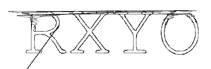

# RXYO: A simple XY oscilloscope implemented with Raylib and Miniaudio 



[Logo as a `.wav` file](rxyo.wav)

## What?

This is a simple implementation of a xy oscilloscope using raylib and miniaudio that
showcases the following:

+ Capture of audio from the user's microphone to an internal ring buffer
+ Plot it into the screen using the audio's left channel for the x coordinate
  and the right channel for the y coordinate.
+ Interpolate it using cubic interpolation to simulate upsampling+lowpassing

## Why?

I did it as an excercise in Raylib and because I like oscilloscope music but oscilloscopes are too heavy to carry and I move a lot. There is also a specific challenge in implementing a XY oscilloscope:

+ The audio rate and the display refresh rate are different.

## How?

The code should be self-documented. If something is not clear feel free to recommend changes. The main idea is this:

+ Have two ring buffers and an index which points to which buffer to write to.
+ When capturing, write to one of the buffers.
+ When plotting, switch the index to the other buffer, and plot from the current buffer.


## Requirements
+ [Raylib](https://www.raylib.com/)
+ A C compiler

## Compilation
```
cc -g -o rxyo rxyo.c -lraylib -lGL -lm -lpthread -ldl -lrt -lX11
```

## Usage

Just start it with `./rxyo`. You can then choose from the inputs shown on screen by pressing one of the numbers corresponding to the system's input. Press `m` to turn off the shortcuts' menu and `esc` to exit.
